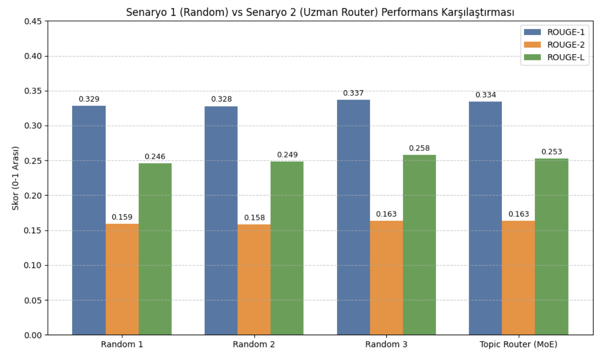
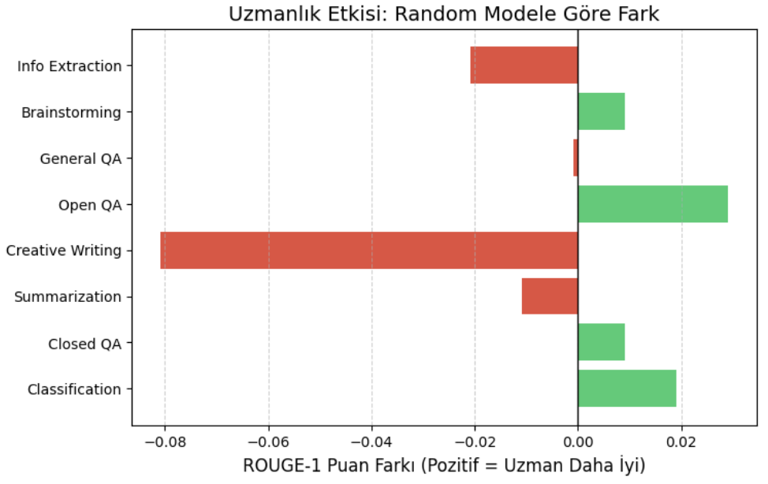

# Comparative Analysis of SFT Strategies: Random Ensembles vs. Topic-Based Mixture of Experts (MoE)

## Project Overview
This project investigates the impact of data distribution strategies on Large Language Model (LLM) fine-tuning. Using the **Llama-3.2-3B** model and the **Databricks-Dolly-15k** dataset, we compare two Supervised Fine-Tuning (SFT) approaches:
1.  **Random Disjoint Splits (Bagging Simulation):** Training independent models on randomly shuffled data subsets.
2.  **Topic-Based Mixture of Experts (MoE):** Training specialized expert models on categorical data subsets (e.g., Creative Writing, Coding, History).

## Key Findings
* **Quantitative:** The MoE approach achieved competitive ROUGE scores compared to generalist models, even with significantly less data per expert.
* **Qualitative:** Expert models demonstrated superior performance in **style transfer** (e.g., writing poems), **format adherence** (e.g., JSON output), and **hallucination resistance**.

## Results

### 1. Performance Comparison (ROUGE Scores)
 
*Figure 1: Comparison of Random Ensemble vs. Topic Router.*

### 2. The Effect of Specialization

*Figure 2: Impact of specialization on ROUGE scores across different categories.*

## Installation & Usage

### Requirements
```bash
pip install -U transformers peft bitsandbytes trl
